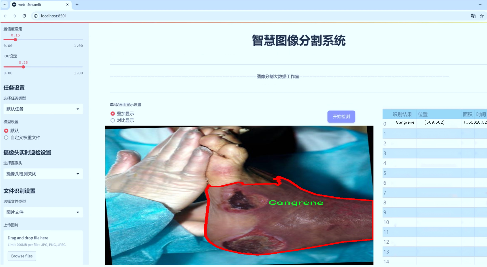
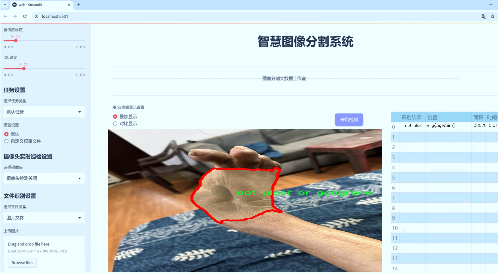
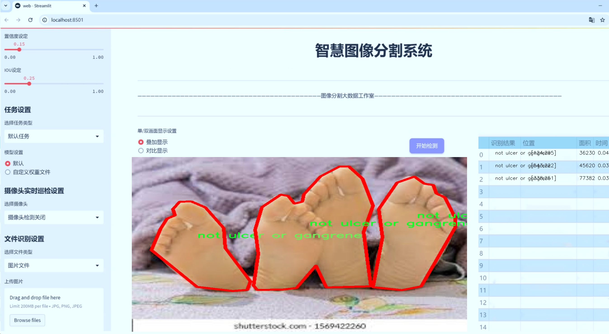
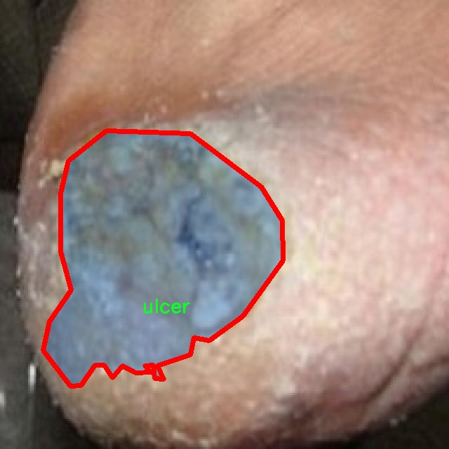
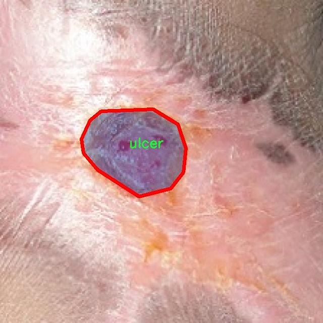
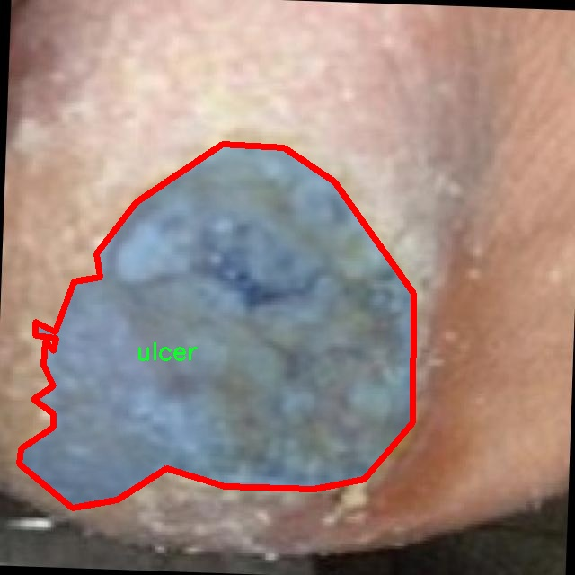
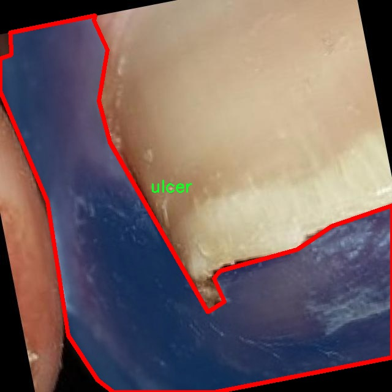
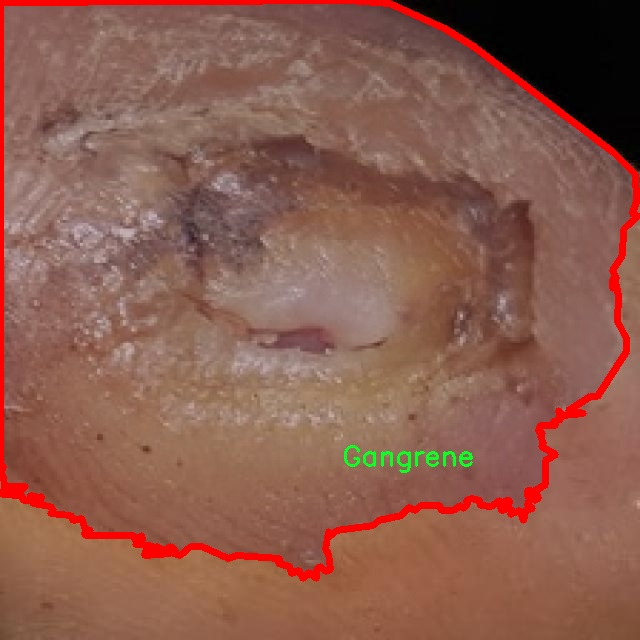

# 坏疽图像分割系统源码＆数据集分享
 [yolov8-seg-LSKNet＆yolov8-seg-p6等50+全套改进创新点发刊_一键训练教程_Web前端展示]

### 1.研究背景与意义

项目参考[ILSVRC ImageNet Large Scale Visual Recognition Challenge](https://gitee.com/YOLOv8_YOLOv11_Segmentation_Studio/projects)

项目来源[AAAI Global Al lnnovation Contest](https://kdocs.cn/l/cszuIiCKVNis)

研究背景与意义

坏疽是一种严重的组织坏死状态，通常由缺血、感染或其他病理因素引起，能够导致肢体的功能丧失甚至危及生命。随着人口老龄化和慢性疾病的增加，坏疽的发病率逐年上升，给医疗系统带来了巨大的压力。因此，早期准确地识别和分割坏疽图像，对于临床诊断和治疗方案的制定至关重要。传统的图像处理方法在处理复杂的医学图像时，往往面临着效率低下和准确性不足的问题。近年来，深度学习技术的快速发展为医学图像分析提供了新的解决方案，尤其是基于卷积神经网络（CNN）的目标检测和图像分割模型，如YOLO（You Only Look Once）系列模型，展现出了优异的性能。

YOLOv8作为YOLO系列的最新版本，在实时性和准确性方面都有了显著提升，能够在复杂的图像环境中快速、准确地进行目标检测和分割。然而，针对坏疽图像的特定需求，YOLOv8仍然存在一些不足之处，例如对不同类型坏疽的细微差别识别能力不足，以及在处理背景复杂的图像时可能出现的误判。因此，改进YOLOv8以适应坏疽图像分割的需求，具有重要的研究意义。

本研究基于改进YOLOv8模型，构建一个专门针对坏疽图像的分割系统。所使用的数据集包含1400幅图像，涵盖了三类目标：坏疽、非溃疡或坏疽、溃疡。这一数据集的多样性和丰富性为模型的训练提供了良好的基础，使其能够学习到不同类型坏疽的特征，从而提高分割的准确性和鲁棒性。通过对模型进行针对性的改进，例如优化网络结构、调整损失函数、增强数据集等，期望能够提升模型在坏疽图像分割任务中的表现。

此外，研究的意义还体现在推动医学图像分析技术的发展上。通过将深度学习与医学图像处理相结合，不仅能够提高坏疽的早期诊断率，还能够为其他相关疾病的图像分析提供借鉴。改进后的YOLOv8模型可以为临床医生提供更为精准的辅助诊断工具，帮助他们在复杂的临床环境中快速做出决策，进而改善患者的治疗效果和预后。

综上所述，基于改进YOLOv8的坏疽图像分割系统的研究，不仅具有重要的理论价值，也具有广泛的应用前景。通过提升坏疽图像的分割精度和效率，将为医学图像分析领域的研究提供新的思路，同时为临床实践带来切实的帮助，推动医疗技术的进步。

### 2.图片演示







##### 注意：由于此博客编辑较早，上面“2.图片演示”和“3.视频演示”展示的系统图片或者视频可能为老版本，新版本在老版本的基础上升级如下：（实际效果以升级的新版本为准）

  （1）适配了YOLOV8的“目标检测”模型和“实例分割”模型，通过加载相应的权重（.pt）文件即可自适应加载模型。

  （2）支持“图片识别”、“视频识别”、“摄像头实时识别”三种识别模式。

  （3）支持“图片识别”、“视频识别”、“摄像头实时识别”三种识别结果保存导出，解决手动导出（容易卡顿出现爆内存）存在的问题，识别完自动保存结果并导出到tempDir中。

  （4）支持Web前端系统中的标题、背景图等自定义修改，后面提供修改教程。

  另外本项目提供训练的数据集和训练教程,暂不提供权重文件（best.pt）,需要您按照教程进行训练后实现图片演示和Web前端界面演示的效果。

### 3.视频演示

[3.1 视频演示](https://www.bilibili.com/video/BV1yA1GYbEeA/)

### 4.数据集信息展示

##### 4.1 本项目数据集详细数据（类别数＆类别名）

nc: 3
names: ['Gangrene', 'not ulcer or gangrene', 'ulcer']


##### 4.2 本项目数据集信息介绍

数据集信息展示

在本研究中，我们使用了名为“Gangrene”的数据集，旨在训练和改进YOLOv8-seg模型，以实现对坏疽图像的精确分割。该数据集专门设计用于医学图像处理，尤其是针对坏疽及其相关病症的自动识别与分割。通过对该数据集的深入分析与应用，我们希望能够提高模型在临床环境中的实用性和准确性。

“Gangrene”数据集包含三种主要类别，分别为“Gangrene”、“not ulcer or gangrene”和“ulcer”。这三类的划分不仅反映了不同病理状态的特征，还为模型的训练提供了丰富的样本，以便其能够在实际应用中更好地区分这些状态。具体而言，“Gangrene”类别包含了典型的坏疽图像，这些图像展示了组织坏死的明显特征，如颜色变化、组织结构的破坏等，具有较高的复杂性和多样性。而“not ulcer or gangrene”类别则包括了其他类型的皮肤病变或健康组织，这些图像的特征与坏疽有显著区别，帮助模型学习如何排除非目标对象。最后，“ulcer”类别则代表了溃疡的图像，这类图像在某些情况下可能与坏疽相混淆，因此也是模型训练中不可或缺的一部分。

数据集的构建经过了严格的筛选和标注，以确保每一张图像都能准确反映其对应的类别。标注工作由专业的医学影像学专家完成，确保了数据的高质量和可靠性。这一过程不仅提高了数据集的可信度，也为后续的模型训练奠定了坚实的基础。通过使用高质量的标注数据，YOLOv8-seg模型能够更有效地学习到不同类别之间的细微差别，从而在实际应用中实现更高的分割精度。

在数据集的使用过程中，我们还考虑到了数据的多样性和代表性。为了确保模型在不同情况下的鲁棒性，我们尽可能地收集了来自不同患者、不同病理状态下的图像。这种多样性不仅有助于提高模型的泛化能力，也使得模型在面对真实世界中的复杂情况时，能够保持较高的准确性和稳定性。

总之，“Gangrene”数据集为本研究提供了一个坚实的基础，支持我们在改进YOLOv8-seg模型的过程中，深入探索坏疽图像分割的可能性。通过对该数据集的有效利用，我们期望能够在医学图像处理领域取得突破，为临床诊断和治疗提供更为精准的工具和支持。随着研究的深入，我们相信这一数据集将为坏疽及相关疾病的自动识别与处理开辟新的方向，推动医学影像学的发展。











### 5.全套项目环境部署视频教程（零基础手把手教学）

[5.1 环境部署教程链接（零基础手把手教学）](https://www.bilibili.com/video/BV1jG4Ve4E9t/?vd_source=bc9aec86d164b67a7004b996143742dc)


[5.2 安装Python虚拟环境创建和依赖库安装视频教程链接（零基础手把手教学）](https://www.bilibili.com/video/BV1nA4VeYEze/?vd_source=bc9aec86d164b67a7004b996143742dc)

### 6.手把手YOLOV8-seg训练视频教程（零基础小白有手就能学会）

[6.1 手把手YOLOV8-seg训练视频教程（零基础小白有手就能学会）](https://www.bilibili.com/video/BV1cA4VeYETe/?vd_source=bc9aec86d164b67a7004b996143742dc)


按照上面的训练视频教程链接加载项目提供的数据集，运行train.py即可开始训练



     Epoch   gpu_mem       box       obj       cls    labels  img_size
     1/200     0G   0.01576   0.01955  0.007536        22      1280: 100%|██████████| 849/849 [14:42<00:00,  1.04s/it]
               Class     Images     Labels          P          R     mAP@.5 mAP@.5:.95: 100%|██████████| 213/213 [01:14<00:00,  2.87it/s]
                 all       3395      17314      0.994      0.957      0.0957      0.0843

     Epoch   gpu_mem       box       obj       cls    labels  img_size
     2/200     0G   0.01578   0.01923  0.007006        22      1280: 100%|██████████| 849/849 [14:44<00:00,  1.04s/it]
               Class     Images     Labels          P          R     mAP@.5 mAP@.5:.95: 100%|██████████| 213/213 [01:12<00:00,  2.95it/s]
                 all       3395      17314      0.996      0.956      0.0957      0.0845

     Epoch   gpu_mem       box       obj       cls    labels  img_size
     3/200     0G   0.01561    0.0191  0.006895        27      1280: 100%|██████████| 849/849 [10:56<00:00,  1.29it/s]
               Class     Images     Labels          P          R     mAP@.5 mAP@.5:.95: 100%|███████   | 187/213 [00:52<00:00,  4.04it/s]
                 all       3395      17314      0.996      0.957      0.0957      0.0845


### 7.50+种全套YOLOV8-seg创新点代码加载调参视频教程（一键加载写好的改进模型的配置文件）

[7.1 50+种全套YOLOV8-seg创新点代码加载调参视频教程（一键加载写好的改进模型的配置文件）](https://www.bilibili.com/video/BV1Hw4VePEXv/?vd_source=bc9aec86d164b67a7004b996143742dc)

### 8.YOLOV8-seg图像分割算法原理

原始YOLOv8-seg算法原理

YOLOv8-seg算法是YOLO系列模型中的最新版本，于2023年1月推出，代表了计算机视觉领域在目标检测与实例分割任务中的前沿技术。该算法不仅在精度和执行速度上超越了以往的模型，还通过一系列创新设计提升了对小目标和高分辨率图像的处理能力。YOLOv8-seg的设计理念基于对前几代YOLO模型的深入分析，尤其是YOLOv5、YOLOv6和YOLOX的优点，从而形成了一种更加高效和灵活的架构。

YOLOv8-seg的核心在于其独特的网络结构，包括输入层、主干网络、颈部网络和头部网络等主要组件。输入层负责对图像进行预处理和缩放，以适应模型的输入要求。主干网络则通过卷积操作对输入图像进行下采样，提取出重要的特征信息。与之前的YOLO版本相比，YOLOv8-seg在卷积层的设计上进行了重要改进，首个卷积层的卷积核从6x6缩小至3x3，这一变化不仅减少了计算量，还提高了特征提取的精度。

在特征提取方面，YOLOv8-seg引入了C2f模块，这一模块借鉴了YOLOv7中的E-ELAN结构，通过跨层分支连接增强了模型的梯度流动性，从而改善了检测结果的准确性。C2f模块的设计允许网络在多个层次上进行特征融合，使得模型能够更好地捕捉到图像中的细节信息。此外，主干网络末尾的SPPF模块通过引入多个最大池化层，进一步增强了网络对多尺度特征的抽象能力，确保了模型在处理不同大小目标时的鲁棒性。

颈部网络的设计同样是YOLOv8-seg的一大亮点。它采用了特征金字塔网络（FPN）和路径聚合网络（PAN）结构，以有效融合来自不同尺度的特征图信息。这种特征融合策略使得YOLOv8-seg能够在不同层次上捕捉到丰富的上下文信息，从而提高了目标检测和实例分割的性能。通过将不同尺度的特征图传递给头部网络，YOLOv8-seg能够在复杂场景中更准确地识别和分割目标。

在头部网络的设计上，YOLOv8-seg引入了解耦的检测头，这一创新设计将目标检测任务中的分类和回归任务分开处理，显著提高了模型的灵活性和准确性。传统的YOLO模型通常采用耦合头，这种设计在处理复杂场景时容易导致信息的混淆。而YOLOv8-seg的解耦头通过两个并行的卷积分支，分别计算回归和类别的损失，从而实现了更为精准的目标定位和分类。这一设计不仅提升了模型的性能，还简化了损失函数的计算过程，使得训练过程更加高效。

值得一提的是，YOLOv8-seg还引入了新的损失函数，这一损失函数经过精心设计，旨在提高模型在小目标检测和高分辨率图像处理中的表现。通过对损失函数的优化，YOLOv8-seg能够更好地平衡分类和回归任务之间的关系，从而提升整体的检测精度。此外，YOLOv8-seg还采用了无锚点（Anchor-Free）检测策略，去除了传统YOLO模型中的锚框机制，使得模型在处理多样化目标时更加灵活。

在实际应用中，YOLOv8-seg展现出了卓越的性能，尤其是在垃圾分类、医学影像分析等领域。其高效的检测能力和准确的分割效果，使得YOLOv8-seg成为了当前计算机视觉任务中的重要工具。通过结合先进的网络结构和创新的训练策略，YOLOv8-seg不仅提升了目标检测和实例分割的精度，还大幅度降低了计算资源的消耗，确保了在各种硬件平台上的高效运行。

综上所述，YOLOv8-seg算法通过一系列创新设计和结构优化，成功地在目标检测与实例分割领域树立了新的标杆。其独特的主干网络、颈部网络和解耦检测头的设计，不仅提升了模型的性能，还为后续的研究和应用提供了丰富的思路和方向。随着YOLOv8-seg的不断发展和完善，未来在计算机视觉领域的应用前景将更加广阔。


### 9.系统功能展示（检测对象为举例，实际内容以本项目数据集为准）

图9.1.系统支持检测结果表格显示

  图9.2.系统支持置信度和IOU阈值手动调节

  图9.3.系统支持自定义加载权重文件best.pt(需要你通过步骤5中训练获得)

  图9.4.系统支持摄像头实时识别

  图9.5.系统支持图片识别

  图9.6.系统支持视频识别

  图9.7.系统支持识别结果文件自动保存

  图9.8.系统支持Excel导出检测结果数据


### 10.50+种全套YOLOV8-seg创新点原理讲解（非科班也可以轻松写刊发刊，V11版本正在科研待更新）

#### 10.1 由于篇幅限制，每个创新点的具体原理讲解就不一一展开，具体见下列网址中的创新点对应子项目的技术原理博客网址【Blog】：


[10.1 50+种全套YOLOV8-seg创新点原理讲解链接](https://gitee.com/qunmasj/good)

#### 10.2 部分改进模块原理讲解(完整的改进原理见上图和技术博客链接)【如果此小节的图加载失败可以通过CSDN或者Github搜索该博客的标题访问原始博客，原始博客图片显示正常】
### YOLOv8简介
YOLOv8目标检测算法继承了YOLOv1系列的思考,是一种新型端到端的目标检测算法,尽管现在原始检测算法已经开源,但是鲜有发表的相关论文.YOLOv8的网络结构如图所示,主要可分为Input输入端、Backbone骨干神经网络、Neck 混合特征网络层和Head预测层网络共4个部分.

YOLO目标检测算法是一种端到端的One-Slage 目标检测算法，其核心思想是将图像按区域分块进行预测。YOLO将输入图像按照32x32的大小划分成若干个网格，例如416x416的图像将被划分为13x13个网格。当目标物体的中心位于某个网格内时,该网格就会负责输出该物体的边界框和类别置信度。每个网格可以预测多个边界框和多个目标类别,这些边界框和类别的数量可以根据需要进行设置。YOLO算法的输出是一个特征图,包含了每个网格对应的边界框和类别置信度的信息呵。本文采用YOLO最新的YOLOv8模型，其是2022年底发布的最新YOLO系列模型，采用全新的SOTA模型，全新的网络主干结构,如图1所示。
整个网络分为Backbone 骨干网络部分和Head头部网络部分。YOLOv8汲取了前几代网络的优秀特性，骨干网络和 Neck部分遵循CSP的思想，将YOLOv5中的C3模块被替换成了梯度流更丰富C2模块,去掉YOLOv5中 PAN-FPN上采样阶段中的卷积结构,将Backbone不同阶段输出的特征直接送入了上采样操作,模型提供了N/S/M/L/X尺度的不同大小模型,能够满足不同领域业界的需求。本文基于YOLOv8模型设计番茄病虫害检测系统，通过配置模型参数训练番茄图像,得到能够用于部署应用的最优模型。


### 感受野注意力卷积（RFAConv)
#### 标准卷积操作回顾
标准的卷积操作是构造卷积神经网络的基本构件。它利用具有共享参数的滑动窗口提取特征信息，克服了全连通层构造神经网络固有的参数多、计算开销大的问题。设 X R∈C×H×W
表示输入特征图，其中C、H、W分别表示特征图的通道数、高度、宽度。为了清楚地演示卷积核的特征提取过程，我们使用 C = 1 的例子。从每个接受域滑块中提取特征信息的卷积运算可以表示为:


这里，Fi 表示计算后每个卷积滑块得到的值，Xi 表示每个滑块内对应位置的像素值，K表示卷积核，S表示卷积核中的参数个数，N表示接收域滑块的总数。可以看出，每个滑块内相同位置的 feature共享相同的参数Ki。因此，标准的卷积运算并不能捕捉到不同位置所带来的信息差异，这最终在一定程度上限制了卷积神经网络的性能。 

#### 空间注意力回顾
目前，空间注意机制是利用学习得到的注意图来突出每个特征的重要性。与前一节类似，这里以 C=1为例。突出关键特征的空间注意机制可以简单表述为:这里，Fi 表示加权运算后得到的值。xi 和Ai 表示输入特征图和学习到的注意图在不同位置的值，N为输入特征图的高和宽的乘积，表示像素值的总数。


#### 空间注意与标准卷积运算
将注意力机制整合到卷积神经网络中，可以提高卷积神经网络的性能。通过对标准卷积运算和现有空间注意机制的研究，我们认为空间注意机制有效地克服了卷积神经网络固有的参数共享的局限性。目前卷积神经网络中最常用的核大小是 1 × 1和3 × 3。在引入空间注意机制后，提取特征的卷积操作可以是 1 × 1或3 × 3卷积操作。为了直观地展示这个过程，在 1 × 1卷积运算的前面插入了空间注意机制。通过注意图对输入特征图(Re-weight“×”)进行加权运算，最后通过 1 × 1卷积运算提取接收域的滑块特征信息。整个过程可以简单地表示如下:


 这里卷积核K仅代表一个参数值。如果取A i× ki 的值作为一种新的卷积核参数，有趣的是它解决了 1×1卷积运算提取特征时的参数共享问题。然而，关于空间注意机制的传说到此结束。当空间注意机制被插入到3×3卷积运算前面时。具体情况如下:


如上所述，如果取A的值 i × ki (4)式作为一种新的卷积核参数，完全解决了大规模卷积核的参数共享问题。然而，最重要的一点是，卷积核在提取每个接受域滑块的特征时，会共享一些特征。换句话说，每个接收域滑块内都有一个重叠。仔细分析后会发现A12= a21， a13 = a22， a15 = a24……，在这种情况下，每个滑动窗口共享空间注意力地图的权重。因此，空间注意机制没有考虑整个接受域的空间特征，不能有效地解决大规模卷积核的参数共享问题。因此，空间注意机制的有效性受到限制。 

#### 创新空间注意力和标准卷积操作
该博客提出解决了现有空间注意机制的局限性，为空间处理提供了一种创新的解决方案。受RFA的启发，一系列空间注意机制被开发出来，可以进一步提高卷积神经网络的性能。RFA可以看作是一个轻量级即插即用模块，RFA设计的卷积运算(RFAConv)可以代替标准卷积来提高卷积神经网络的性能。因此，我们预测空间注意机制与标准卷积运算的结合将继续发展，并在未来带来新的突破。
接受域空间特征:为了更好地理解接受域空间特征的概念，我们将提供相关的定义。接收域空间特征是专门为卷积核设计的，并根据核大小动态生成。如图1所示，以3×3卷积核为例。在图1中，“Spatial Feature”指的是原始的Feature map。“接受域空间特征”是空间特征变换后的特征图。

 

由不重叠的滑动窗口组成。当使用 3×3卷积内核提取特征时，接收域空间特征中的每个 3×3大小窗口代表一个接收域滑块。接受域注意卷积(RFAConv):针对接受域的空间特征，我们提出了接受域注意卷积(RFA)。该方法不仅强调了接收域滑块内不同特征的重要性，而且对接收域空间特征进行了优先排序。通过该方法，完全解决了卷积核参数共享的问题。接受域空间特征是根据卷积核的大小动态生成的，因此，RFA是卷积的固定组合，不能与卷积操作的帮助分离，卷积操作同时依赖于RFA来提高性能，因此我们提出了接受场注意卷积(RFAConv)。具有3×3大小的卷积核的RFAConv整体结构如图所示。


目前，最广泛使用的接受域特征提取方法是缓慢的。经过大量的研究，我们开发了一种快速的方法，用分组卷积来代替原来的方法。具体来说，我们利用相应大小的分组卷积来动态生成基于接受域大小的展开特征。尽管与原始的无参数方法(如PyTorch提供的nn.())相比，该方法增加了一些参数，但它的速度要快得多。注意:如前一节所述，当使用 3×3卷积内核提取特征时，接收域空间特征中的每个 3×3大小窗口表示一个接收域滑块。而利用快速分组卷积提取感受野特征后，将原始特征映射为新的特征。最近的研究表明。交互信息可以提高网络性能，如[40,41,42]所示。同样，对于RFAConv来说，通过交互接受域特征信息来学习注意图可以提高网络性能。然而，与每个接收域特征交互会导致额外的计算开销，因此为了最小化计算开销和参数的数量，我们使用AvgPool来聚合每个接收域特征的全局信息。然后，使用 1×1 组卷积操作进行信息交互。最后，我们使用softmax来强调每个特征在接受域特征中的重要性。一般情况下，RFA的计算可以表示为:


这里gi×i 表示一个大小为 i×i的分组卷积，k表示卷积核的大小，Norm表示归一化，X表示输入的特征图，F由注意图 a相乘得到 rf 与转换后的接受域空间特征 Frf。与CBAM和CA不同，RFA能够为每个接受域特征生成注意图。卷积神经网络的性能受到标准卷积操作的限制，因为卷积操作依赖于共享参数，对位置变化带来的信息差异不敏感。然而，RFAConv通过强调接收域滑块中不同特征的重要性，并对接收域空间特征进行优先级排序，可以完全解决这个问题。通过RFA得到的feature map是接受域空间特征，在“Adjust Shape”后没有重叠。因此，学习到的注意图将每个接受域滑块的特征信息聚合起来。换句话说，注意力地图不再共享在每个接受域滑块。这完全弥补了现有 CA和CBAM注意机制的不足。RFA为标准卷积内核提供了显著的好处。而在调整形状后，特征的高度和宽度是 k倍，需要进行 stride = k的k × k卷积运算来提取特征信息。RFA设计的卷积运算RFAConv为卷积带来了良好的增益，对标准卷积进行了创新。
此外，我们认为现有的空间注意机制应该优先考虑接受域空间特征，以提高网络性能。众所周知，基于自注意机制的网络模型[43,44,45]取得了很大的成功，因为它解决了卷积参数共享的问题，并对远程信息进行建模。然而，自注意机制也为模型引入了显著的计算开销和复杂性。我们认为，将现有的空间注意机制的注意力引导到接受场空间特征上，可以以类似于自我注意的方式解决长期信息的参数共享和建模问题。与自我关注相比，这种方法需要的参数和计算资源少得多。答案如下:(1)将以接收场空间特征为中心的空间注意机制与卷积相结合，消除了卷积参数共享的问题。(2)现有的空间注意机制已经考虑了远程信息，可以通过全局平均池或全局最大池的方式获取全局信息，其中明确考虑了远程信息。因此，我们设计了新的 CBAM和CA模型，称为RFCBAM和RFCA，它们专注于接受域空间特征。与RFA类似，使用最终的k × k stride = k 的卷积运算来提取特征信息。这两种新的卷积方法的具体结构如图 3所示，我们称这两种新的卷积操作为 RFCBAMConv和RFCAConv。与原来的CBAM相比，我们在RFCBAM中使用SE attention来代替CAM。因为这样可以减少计算开销。此外，在RFCBAM中，通道注意和空间注意不是分开执行的。相反，它们是同时加权的，使得每个通道获得的注意力地图是不同的。


### 11.项目核心源码讲解（再也不用担心看不懂代码逻辑）

#### 11.1 ultralytics\engine\model.py

以下是经过简化和注释的核心代码部分，保留了模型的基本结构和功能，便于理解YOLO模型的实现。

```python
import torch
import inspect
import sys
from pathlib import Path
from typing import Union

# 定义YOLO模型类，继承自nn.Module
class Model(nn.Module):
    """
    YOLO模型的基础类，统一所有模型的API接口。
    """

    def __init__(self, model: Union[str, Path] = 'yolov8n.pt', task=None) -> None:
        """
        初始化YOLO模型。

        Args:
            model (Union[str, Path], optional): 要加载或创建的模型路径或名称，默认为'yolov8n.pt'。
            task (Any, optional): YOLO模型的任务类型，默认为None。
        """
        super().__init__()
        self.model = None  # 模型对象
        self.task = task  # 任务类型
        model = str(model).strip()  # 去除空格

        # 加载或创建新的YOLO模型
        suffix = Path(model).suffix
        if suffix in ('.yaml', '.yml'):
            self._new(model, task)  # 从配置文件创建新模型
        else:
            self._load(model, task)  # 从权重文件加载模型

    def _new(self, cfg: str, task=None):
        """
        从配置文件初始化新模型并推断任务类型。

        Args:
            cfg (str): 模型配置文件
            task (str | None): 模型任务
        """
        cfg_dict = yaml_model_load(cfg)  # 加载yaml配置
        self.task = task or guess_model_task(cfg_dict)  # 推断任务类型
        self.model = self._smart_load('model')(cfg_dict)  # 创建模型

    def _load(self, weights: str, task=None):
        """
        从权重文件加载模型并推断任务类型。

        Args:
            weights (str): 要加载的模型权重
            task (str | None): 模型任务
        """
        self.model, _ = attempt_load_one_weight(weights)  # 加载权重
        self.task = self.model.args['task']  # 获取任务类型

    def predict(self, source=None, stream=False, **kwargs):
        """
        使用YOLO模型进行预测。

        Args:
            source (str | int | PIL | np.ndarray): 要进行预测的图像源。
            stream (bool): 是否流式预测，默认为False。

        Returns:
            (List[ultralytics.engine.results.Results]): 预测结果。
        """
        if source is None:
            source = ASSETS  # 默认源
        # 设置预测参数
        args = {**self.overrides, 'mode': 'predict'}
        if not self.predictor:
            self.predictor = self._smart_load('predictor')(overrides=args)  # 加载预测器
            self.predictor.setup_model(model=self.model)  # 设置模型
        return self.predictor(source=source, stream=stream)  # 进行预测

    def train(self, trainer=None, **kwargs):
        """
        在给定数据集上训练模型。

        Args:
            trainer (BaseTrainer, optional): 自定义训练器。
            **kwargs (Any): 训练配置的任意参数。
        """
        self.trainer = (trainer or self._smart_load('trainer'))(args=kwargs)  # 加载训练器
        self.trainer.train()  # 开始训练

    def _smart_load(self, key):
        """加载模型/训练器/验证器/预测器。"""
        return self.task_map[self.task][key]  # 根据任务类型加载相应的组件

    @property
    def task_map(self):
        """
        任务映射到模型、训练器、验证器和预测器类的映射。

        Returns:
            task_map (dict): 任务到模式类的映射。
        """
        raise NotImplementedError('请为您的模型提供任务映射！')
```

### 代码说明：
1. **Model类**：定义了YOLO模型的基本结构，继承自`nn.Module`。
2. **初始化方法**：根据传入的模型路径或名称加载或创建模型。
3. **_new和_load方法**：分别用于从配置文件和权重文件加载模型。
4. **predict方法**：执行预测操作，支持多种输入源。
5. **train方法**：用于训练模型。
6. **_smart_load方法**：根据任务类型加载相应的组件。
7. **task_map属性**：定义任务与模型组件的映射关系，需在子类中实现。

此代码提供了YOLO模型的基本功能，包括模型的加载、预测和训练等，便于后续扩展和使用。

这个文件是Ultralytics YOLO模型的核心实现部分，主要定义了一个名为`Model`的类，该类用于统一所有YOLO模型的API。该类的构造函数接受模型文件的路径或名称以及任务类型作为参数，并根据这些信息初始化模型。

在初始化过程中，首先会检查模型是否来自Ultralytics HUB或Triton Server，如果是，则相应地处理模型文件。接着，程序会根据文件后缀判断是加载已有的模型权重（如`.pt`文件）还是新的模型配置（如`.yaml`文件），并调用相应的方法进行加载或创建。

`Model`类中定义了多个方法，主要包括：

- `__call__`：重载了调用运算符，使得可以直接通过`Model`实例进行预测。
- `_new`和`_load`：分别用于初始化新模型和加载已有模型的权重。
- `_check_is_pytorch_model`：检查当前模型是否为PyTorch模型，如果不是则抛出错误。
- `reset_weights`：重置模型的参数，随机初始化所有权重。
- `load`：加载权重到模型中。
- `info`：记录并返回模型的信息。
- `fuse`：融合模型中的卷积层和批归一化层，以加快推理速度。
- `predict`：执行预测，接受多种输入源（如文件路径、图像数组等）。
- `track`：进行目标跟踪。
- `val`：在给定数据集上验证模型。
- `benchmark`：对模型在所有导出格式上进行基准测试。
- `export`：导出模型到不同格式。
- `train`：在给定数据集上训练模型。
- `tune`：进行超参数调优。

此外，类中还包含了一些辅助方法，如添加和清除回调函数、重置回调、智能加载模型组件等。模型的设备信息、名称和变换等属性也通过属性方法提供。

总的来说，这个文件为YOLO模型的加载、训练、预测和验证提供了一个统一的接口，封装了许多复杂的操作，使得用户可以方便地使用YOLO模型进行各种任务。

#### 11.2 ultralytics\nn\extra_modules\orepa.py

以下是代码中最核心的部分，并附上详细的中文注释：

```python
import torch
import torch.nn as nn
import torch.nn.functional as F
import numpy as np

# 定义一个OREPA模块，继承自nn.Module
class OREPA(nn.Module):
    def __init__(self, in_channels, out_channels, kernel_size=3, stride=1, padding=None, groups=1, dilation=1, act=True):
        super(OREPA, self).__init__()
        
        # 激活函数的选择
        self.nonlinear = nn.ReLU() if act else nn.Identity()
        
        # 保存输入和输出通道数
        self.in_channels = in_channels
        self.out_channels = out_channels
        self.groups = groups
        
        # 计算填充
        padding = (kernel_size - 1) // 2 if padding is None else padding
        self.padding = padding
        self.stride = stride
        self.dilation = dilation
        
        # 定义多个权重参数
        self.weight_orepa_origin = nn.Parameter(torch.Tensor(out_channels, in_channels // groups, kernel_size, kernel_size))
        self.weight_orepa_avg_conv = nn.Parameter(torch.Tensor(out_channels, in_channels // groups, 1, 1))
        self.weight_orepa_pfir_conv = nn.Parameter(torch.Tensor(out_channels, in_channels // groups, 1, 1))
        
        # 权重初始化
        nn.init.kaiming_uniform_(self.weight_orepa_origin, a=0.0)
        nn.init.kaiming_uniform_(self.weight_orepa_avg_conv, a=0.0)
        nn.init.kaiming_uniform_(self.weight_orepa_pfir_conv, a=0.0)

        # 定义一个用于生成权重的向量
        self.vector = nn.Parameter(torch.Tensor(6, out_channels))
        self.fre_init()  # 自定义初始化方法

    def fre_init(self):
        # 初始化prior_tensor
        prior_tensor = torch.Tensor(self.out_channels, 3, 3)
        half_fg = self.out_channels / 2
        for i in range(self.out_channels):
            for h in range(3):
                for w in range(3):
                    if i < half_fg:
                        prior_tensor[i, h, w] = np.cos(np.pi * (h + 0.5) * (i + 1) / 3)
                    else:
                        prior_tensor[i, h, w] = np.cos(np.pi * (w + 0.5) * (i + 1 - half_fg) / 3)
        self.register_buffer('weight_orepa_prior', prior_tensor)

    def weight_gen(self):
        # 生成权重
        weight_orepa_origin = self.weight_orepa_origin * self.vector[0, :].view(-1, 1, 1, 1)
        weight_orepa_avg = self.weight_orepa_avg_conv * self.vector[1, :].view(-1, 1, 1, 1)
        weight_orepa_pfir = self.weight_orepa_pfir_conv * self.vector[2, :].view(-1, 1, 1, 1)

        # 将所有权重相加
        weight = weight_orepa_origin + weight_orepa_avg + weight_orepa_pfir
        return weight

    def forward(self, inputs):
        # 前向传播
        weight = self.weight_gen()  # 生成权重
        out = F.conv2d(inputs, weight, stride=self.stride, padding=self.padding, dilation=self.dilation, groups=self.groups)
        return self.nonlinear(out)  # 应用激活函数

# 示例：创建OREPA模块并进行前向传播
model = OREPA(in_channels=3, out_channels=16)
input_tensor = torch.randn(1, 3, 32, 32)  # 随机输入
output = model(input_tensor)  # 前向传播
print(output.shape)  # 输出形状
```

### 代码说明：
1. **OREPA类**：这是一个自定义的卷积模块，使用了多种卷积权重的组合来生成最终的卷积核。
2. **初始化方法**：在构造函数中，定义了输入和输出通道、卷积核大小、步幅、填充等参数，并初始化了多个权重参数。
3. **fre_init方法**：用于初始化一个名为`weight_orepa_prior`的张量，使用余弦函数生成特定的值。
4. **weight_gen方法**：根据定义的权重和向量生成最终的卷积权重。
5. **forward方法**：实现前向传播，使用生成的权重对输入进行卷积操作，并应用激活函数。

该模块的设计使得它在部署时可以高效地使用，适合在深度学习模型中进行卷积操作。

这个程序文件 `orepa.py` 定义了一些用于深度学习的模块，主要是与卷积神经网络（CNN）相关的自定义层。以下是对文件中代码的详细讲解。

首先，文件导入了一些必要的库，包括 PyTorch 和 NumPy。然后定义了一些辅助函数，例如 `transI_fusebn` 和 `transVI_multiscale`，这些函数用于处理卷积核和批归一化（Batch Normalization）层的融合，以及对卷积核进行多尺度填充。

接下来，定义了 `OREPA` 类，这是一个自定义的卷积层。它的构造函数接受多个参数，包括输入和输出通道数、卷积核大小、步幅、填充、分组卷积、扩张率等。根据 `deploy` 参数的值，类会初始化不同的卷积结构。如果 `deploy` 为真，则会创建一个标准的卷积层；否则，创建多个卷积权重和相关参数。

在 `OREPA` 类中，权重的初始化使用了 Kaiming 初始化方法，并且通过 `fre_init` 方法初始化了一些特定的权重。`weight_gen` 方法生成最终的卷积权重，结合了不同的卷积分支的权重。

`forward` 方法定义了前向传播的逻辑。如果 `deploy` 为真，则直接使用预先计算好的卷积层；否则，通过生成的权重进行卷积操作，并应用非线性激活函数和批归一化。

接下来，定义了 `OREPA_LargeConv` 类，它类似于 `OREPA`，但专注于处理更大的卷积核。它的结构与 `OREPA` 类似，使用多个 `OREPA` 层来构建更复杂的卷积操作。

`ConvBN` 类是一个简单的卷积层，结合了卷积和批归一化。它的构造函数接受卷积的参数，并根据 `deploy` 参数的值选择是否使用批归一化。

`OREPA_3x3_RepVGG` 类是一个更复杂的卷积层，结合了多个卷积分支，并使用了特定的初始化和权重生成方法。它的设计允许在不同的条件下（如使用或不使用分支）灵活地生成卷积权重。

最后，`RepVGGBlock_OREPA` 类定义了一个完整的卷积块，结合了多个卷积层和激活函数，并支持可选的注意力机制（SEAttention）。这个类的设计使得在推理阶段可以使用一个标准的卷积层，而在训练阶段则使用更复杂的结构。

总体来说，这个文件实现了一种灵活且高效的卷积神经网络模块，支持多种卷积结构和初始化方式，适用于各种深度学习任务。

#### 11.3 ultralytics\nn\extra_modules\RFAConv.py

以下是保留的核心代码部分，并附上详细的中文注释：

```python
import torch
import torch.nn as nn
from einops import rearrange

class h_sigmoid(nn.Module):
    """实现h-sigmoid激活函数"""
    def __init__(self, inplace=True):
        super(h_sigmoid, self).__init__()
        self.relu = nn.ReLU6(inplace=inplace)  # 使用ReLU6作为基础

    def forward(self, x):
        return self.relu(x + 3) / 6  # h-sigmoid的计算公式

class h_swish(nn.Module):
    """实现h-swish激活函数"""
    def __init__(self, inplace=True):
        super(h_swish, self).__init__()
        self.sigmoid = h_sigmoid(inplace=inplace)  # 使用h-sigmoid作为基础

    def forward(self, x):
        return x * self.sigmoid(x)  # h-swish的计算公式

class RFAConv(nn.Module):
    """实现RFA卷积模块"""
    def __init__(self, in_channel, out_channel, kernel_size, stride=1):
        super().__init__()
        self.kernel_size = kernel_size

        # 计算权重的卷积层
        self.get_weight = nn.Sequential(
            nn.AvgPool2d(kernel_size=kernel_size, padding=kernel_size // 2, stride=stride),
            nn.Conv2d(in_channel, in_channel * (kernel_size ** 2), kernel_size=1, groups=in_channel, bias=False)
        )
        
        # 生成特征的卷积层
        self.generate_feature = nn.Sequential(
            nn.Conv2d(in_channel, in_channel * (kernel_size ** 2), kernel_size=kernel_size, padding=kernel_size // 2, stride=stride, groups=in_channel, bias=False),
            nn.BatchNorm2d(in_channel * (kernel_size ** 2)),
            nn.ReLU()
        )
        
        # 最终的卷积层
        self.conv = nn.Conv2d(in_channel, out_channel, kernel_size=kernel_size, stride=kernel_size)

    def forward(self, x):
        b, c = x.shape[0:2]  # 获取输入的批量大小和通道数
        weight = self.get_weight(x)  # 计算权重
        h, w = weight.shape[2:]  # 获取特征图的高度和宽度
        
        # 对权重进行softmax归一化
        weighted = weight.view(b, c, self.kernel_size ** 2, h, w).softmax(2)
        feature = self.generate_feature(x).view(b, c, self.kernel_size ** 2, h, w)  # 生成特征
        
        # 加权特征
        weighted_data = feature * weighted
        conv_data = rearrange(weighted_data, 'b c (n1 n2) h w -> b c (h n1) (w n2)', n1=self.kernel_size, n2=self.kernel_size)  # 重排数据
        return self.conv(conv_data)  # 返回卷积结果

class SE(nn.Module):
    """实现Squeeze-and-Excitation模块"""
    def __init__(self, in_channel, ratio=16):
        super(SE, self).__init__()
        self.gap = nn.AdaptiveAvgPool2d((1, 1))  # 全局平均池化
        self.fc = nn.Sequential(
            nn.Linear(in_channel, ratio, bias=False),  # 从c到c/r
            nn.ReLU(),
            nn.Linear(ratio, in_channel, bias=False),  # 从c/r到c
            nn.Sigmoid()
        )

    def forward(self, x):
        b, c = x.shape[0:2]  # 获取输入的批量大小和通道数
        y = self.gap(x).view(b, c)  # 进行全局平均池化并展平
        y = self.fc(y).view(b, c, 1, 1)  # 通过全连接层
        return y  # 返回通道注意力

class RFCBAMConv(nn.Module):
    """实现RFCBAM卷积模块"""
    def __init__(self, in_channel, out_channel, kernel_size=3, stride=1):
        super().__init__()
        self.kernel_size = kernel_size
        
        # 生成特征的卷积层
        self.generate = nn.Sequential(
            nn.Conv2d(in_channel, in_channel * (kernel_size ** 2), kernel_size, padding=kernel_size // 2, stride=stride, groups=in_channel, bias=False),
            nn.BatchNorm2d(in_channel * (kernel_size ** 2)),
            nn.ReLU()
        )
        
        # 计算权重的卷积层
        self.get_weight = nn.Sequential(nn.Conv2d(2, 1, kernel_size=3, padding=1, bias=False), nn.Sigmoid())
        self.se = SE(in_channel)  # Squeeze-and-Excitation模块

        # 最终的卷积层
        self.conv = nn.Conv2d(in_channel, out_channel, kernel_size=kernel_size, stride=kernel_size)

    def forward(self, x):
        b, c = x.shape[0:2]  # 获取输入的批量大小和通道数
        channel_attention = self.se(x)  # 计算通道注意力
        generate_feature = self.generate(x)  # 生成特征

        h, w = generate_feature.shape[2:]  # 获取特征图的高度和宽度
        generate_feature = generate_feature.view(b, c, self.kernel_size ** 2, h, w)  # 重排特征

        # 重排特征以便进行后续操作
        generate_feature = rearrange(generate_feature, 'b c (n1 n2) h w -> b c (h n1) (w n2)', n1=self.kernel_size, n2=self.kernel_size)
        
        # 计算最大和平均特征
        max_feature, _ = torch.max(generate_feature, dim=1, keepdim=True)
        mean_feature = torch.mean(generate_feature, dim=1, keepdim=True)
        
        # 计算接收场注意力
        receptive_field_attention = self.get_weight(torch.cat((max_feature, mean_feature), dim=1))
        conv_data = generate_feature * channel_attention * receptive_field_attention  # 加权特征
        return self.conv(conv_data)  # 返回卷积结果
```

### 代码说明：
1. **h_sigmoid 和 h_swish**：这两个类实现了h-sigmoid和h-swish激活函数，分别用于非线性变换。
2. **RFAConv**：实现了一个基于加权特征的卷积模块，首先计算特征的权重，然后生成特征并进行加权，最后通过卷积层输出结果。
3. **SE**：实现了Squeeze-and-Excitation模块，通过全局平均池化和全连接层生成通道注意力。
4. **RFCBAMConv**：结合了特征生成、通道注意力和接收场注意力的卷积模块，最终输出加权后的卷积结果。

这些模块在深度学习模型中常用于增强特征表示能力和提升模型性能。

这个程序文件实现了一些自定义的卷积模块，主要包括RFAConv、RFCBAMConv和RFCAConv等。文件中使用了PyTorch框架，并引入了一些辅助模块和操作。下面对代码进行逐步讲解。

首先，文件引入了必要的库，包括PyTorch的神经网络模块（torch.nn）和einops库（用于重排张量）。接着，定义了几个激活函数类：h_sigmoid和h_swish。这两个类分别实现了h-sigmoid和h-swish激活函数，主要用于后续卷积模块中的非线性变换。

接下来，定义了RFAConv类，这是一个自定义的卷积层。它的构造函数接受输入通道数、输出通道数、卷积核大小和步幅作为参数。RFAConv的核心思想是通过加权的方式生成特征图。它首先通过一个平均池化层和一个卷积层来获取权重，然后通过另一个卷积层生成特征图。接着，特征图和权重进行逐元素相乘，最后将结果重排并通过一个卷积层输出。

然后，定义了SE类（Squeeze-and-Excitation），用于实现通道注意力机制。它通过全局平均池化和全连接层来计算每个通道的重要性，并通过sigmoid函数进行归一化，输出一个与输入相同形状的张量。

接下来是RFCBAMConv类，它结合了RFAConv和SE模块。RFCBAMConv在生成特征图后，使用SE模块计算通道注意力，并通过最大池化和平均池化获取特征的最大值和平均值。然后，将这些特征拼接在一起，经过卷积层计算得到注意力权重，最后将加权后的特征图通过卷积层输出。

最后，RFCAConv类实现了一个结合了通道和空间注意力机制的卷积模块。它首先生成特征图，然后通过自适应平均池化获取特征的高度和宽度信息，并将它们拼接在一起。接着，通过卷积层计算注意力权重，最后将生成的特征图与注意力权重相乘并通过卷积层输出。

整体来看，这个文件实现了一些复杂的卷积操作，利用注意力机制来增强特征提取能力，适用于深度学习中的图像处理任务。

#### 11.4 ultralytics\models\yolo\detect\val.py

以下是经过简化并添加详细中文注释的核心代码部分：

```python
import os
import torch
from ultralytics.engine.validator import BaseValidator
from ultralytics.utils import LOGGER, ops
from ultralytics.utils.metrics import DetMetrics, box_iou
from ultralytics.utils.plotting import output_to_target, plot_images

class DetectionValidator(BaseValidator):
    """
    继承自BaseValidator类，用于基于检测模型的验证。
    """

    def __init__(self, dataloader=None, save_dir=None, pbar=None, args=None, _callbacks=None):
        """初始化检测模型所需的变量和设置。"""
        super().__init__(dataloader, save_dir, pbar, args, _callbacks)
        self.metrics = DetMetrics(save_dir=self.save_dir)  # 初始化检测指标
        self.iouv = torch.linspace(0.5, 0.95, 10)  # 定义IoU向量，用于计算mAP@0.5:0.95
        self.niou = self.iouv.numel()  # IoU的数量

    def preprocess(self, batch):
        """对YOLO训练的图像批次进行预处理。"""
        # 将图像数据转移到设备上，并进行归一化处理
        batch['img'] = batch['img'].to(self.device, non_blocking=True) / 255
        batch['img'] = batch['img'].half() if self.args.half else batch['img'].float()
        
        # 将其他必要的数据转移到设备上
        for k in ['batch_idx', 'cls', 'bboxes']:
            batch[k] = batch[k].to(self.device)

        return batch

    def postprocess(self, preds):
        """对预测输出应用非极大值抑制（NMS）。"""
        return ops.non_max_suppression(preds,
                                       self.args.conf,
                                       self.args.iou,
                                       multi_label=True,
                                       agnostic=self.args.single_cls,
                                       max_det=self.args.max_det)

    def update_metrics(self, preds, batch):
        """更新检测指标。"""
        for si, pred in enumerate(preds):
            idx = batch['batch_idx'] == si  # 获取当前批次的索引
            cls = batch['cls'][idx]  # 获取当前批次的类别
            bbox = batch['bboxes'][idx]  # 获取当前批次的边界框
            npr = pred.shape[0]  # 预测的数量

            if npr == 0:  # 如果没有预测结果
                continue

            # 处理预测结果
            predn = pred.clone()  # 克隆预测结果
            ops.scale_boxes(batch['img'][si].shape[1:], predn[:, :4], batch['ori_shape'][si])  # 将预测框转换为原始图像空间

            # 计算指标
            if cls.shape[0] > 0:  # 如果有真实标签
                correct_bboxes = self._process_batch(predn, torch.cat((cls, bbox), 1))  # 处理批次并计算正确的边界框

            # 保存预测结果
            if self.args.save_json:
                self.pred_to_json(predn, batch['im_file'][si])  # 保存为JSON格式

    def get_stats(self):
        """返回指标统计信息和结果字典。"""
        stats = [torch.cat(x, 0).cpu().numpy() for x in zip(*self.stats)]  # 转换为numpy数组
        if len(stats) and stats[0].any():
            self.metrics.process(*stats)  # 处理指标
        return self.metrics.results_dict  # 返回结果字典

    def print_results(self):
        """打印每个类别的训练/验证集指标。"""
        pf = '%22s' + '%11i' * 2 + '%11.3g' * len(self.metrics.keys)  # 打印格式
        LOGGER.info(pf % ('all', self.seen, self.nt_per_class.sum(), *self.metrics.mean_results()))  # 打印总体结果

    def _process_batch(self, detections, labels):
        """
        返回正确的预测矩阵。

        参数:
            detections (torch.Tensor): 形状为[N, 6]的检测结果张量。
            labels (torch.Tensor): 形状为[M, 5]的标签张量。

        返回:
            (torch.Tensor): 形状为[N, 10]的正确预测矩阵，包含10个IoU水平。
        """
        iou = box_iou(labels[:, 1:], detections[:, :4])  # 计算IoU
        return self.match_predictions(detections[:, 5], labels[:, 0], iou)  # 匹配预测和标签
```

### 代码说明：
1. **DetectionValidator类**：这是一个用于检测模型验证的类，继承自`BaseValidator`。
2. **初始化方法**：设置了一些基本参数，包括检测指标、IoU范围等。
3. **预处理方法**：将输入的图像批次进行归一化和设备转移。
4. **后处理方法**：对预测结果应用非极大值抑制，减少重复检测。
5. **更新指标方法**：计算并更新检测指标，包括正确的边界框和保存预测结果。
6. **获取统计信息方法**：将指标转换为numpy数组并返回结果字典。
7. **打印结果方法**：打印每个类别的检测结果。
8. **处理批次方法**：计算IoU并返回正确的预测矩阵。

这个程序文件是一个用于YOLO（You Only Look Once）目标检测模型验证的Python脚本，属于Ultralytics YOLO框架的一部分。文件的主要功能是实现对目标检测模型的验证过程，包括数据预处理、指标计算、结果输出等。

首先，程序导入了一些必要的库和模块，包括操作系统相关的库、NumPy、PyTorch以及Ultralytics框架中的一些工具和模块。接着，定义了一个名为`DetectionValidator`的类，该类继承自`BaseValidator`，用于实现基于检测模型的验证。

在`__init__`方法中，初始化了一些变量和设置，包括数据加载器、保存目录、进度条、参数等。还定义了一些与评估相关的指标，比如`DetMetrics`用于存储检测指标，`ConfusionMatrix`用于计算混淆矩阵等。

`preprocess`方法负责对输入的图像批次进行预处理，包括将图像转换为适合模型输入的格式，并将标签和边界框数据转移到指定的设备上（如GPU）。如果设置了混合保存（`save_hybrid`），还会为自动标注准备标签。

`init_metrics`方法用于初始化评估指标，检查数据集是否为COCO格式，并根据模型的类别名称设置相关参数。

`get_desc`方法返回一个格式化的字符串，用于总结YOLO模型的类别指标。

`postprocess`方法实现了非极大值抑制（NMS），用于处理模型的预测输出，以去除冗余的检测框。

`update_metrics`方法用于更新评估指标，通过比较预测结果和真实标签，计算正确的边界框，并更新混淆矩阵。

`finalize_metrics`方法设置最终的指标值，包括速度和混淆矩阵。

`get_stats`方法返回评估统计信息和结果字典，计算每个类别的目标数量。

`print_results`方法打印训练或验证集的每个类别的指标，显示整体和每个类别的检测结果。

`_process_batch`方法用于处理每个批次的检测结果，计算IOU（Intersection over Union）并返回正确的预测矩阵。

`build_dataset`和`get_dataloader`方法用于构建YOLO数据集和返回数据加载器，支持不同的批次大小和模式（训练或验证）。

`plot_val_samples`和`plot_predictions`方法用于绘制验证样本和预测结果，并将结果保存为图像文件。

`save_one_txt`方法将YOLO检测结果保存为文本文件，采用特定的格式。

`pred_to_json`方法将YOLO的预测结果序列化为COCO格式的JSON文件，方便后续评估。

`eval_json`方法用于评估YOLO输出的JSON格式结果，并返回性能统计信息，支持与COCO评估工具的集成。

总体而言，这个文件实现了YOLO模型验证的各个步骤，从数据预处理到结果评估，提供了完整的验证流程，适用于目标检测任务。

#### 11.5 ultralytics\trackers\__init__.py

以下是经过简化和详细注释的核心代码部分：

```python
# 导入所需的跟踪器类
from .bot_sort import BOTSORT  # 导入BOTSORT类，用于目标跟踪
from .byte_tracker import BYTETracker  # 导入BYTETracker类，用于另一种目标跟踪算法
from .track import register_tracker  # 导入注册跟踪器的函数

# 定义模块的公开接口，允许其他模块简单导入
__all__ = 'register_tracker', 'BOTSORT', 'BYTETracker'  # 指定可以被外部访问的类和函数
```

### 代码注释说明：
1. **导入模块**：
   - `from .bot_sort import BOTSORT`：从当前包中导入 `BOTSORT` 类，该类实现了一种基于排序的目标跟踪算法。
   - `from .byte_tracker import BYTETracker`：从当前包中导入 `BYTETracker` 类，该类实现了另一种目标跟踪算法，通常基于字节流的方式进行跟踪。
   - `from .track import register_tracker`：从当前包中导入 `register_tracker` 函数，用于注册不同的跟踪器，使得可以在系统中使用这些跟踪器。

2. **公开接口**：
   - `__all__` 是一个特殊变量，用于定义当使用 `from module import *` 时，哪些名称会被导入。这里指定了 `register_tracker`、`BOTSORT` 和 `BYTETracker`，使得其他模块可以简单地导入这些功能。

这个程序文件是Ultralytics YOLO项目中的一个初始化文件，通常用于定义模块的公共接口。在这个文件中，首先通过注释说明了该项目使用的是AGPL-3.0许可证。接下来，文件导入了三个组件：`BOTSORT`、`BYTETracker`和`register_tracker`。这些组件分别来自于同一目录下的不同模块。

`BOTSORT`和`BYTETracker`是两个跟踪算法的实现，可能用于目标检测和跟踪任务。`register_tracker`函数则用于注册这些跟踪器，使得它们可以在其他模块中被调用。

最后，`__all__`变量被定义为一个包含字符串的元组，列出了可以通过`from module import *`语句导入的公共接口。这种做法可以帮助用户更方便地使用模块中的功能，同时也有助于避免不必要的命名冲突。

总的来说，这个文件的主要作用是组织和暴露跟踪器相关的功能，使得其他模块能够轻松地导入和使用这些功能。

### 12.系统整体结构（节选）

### 程序整体功能和构架概括

Ultralytics YOLO项目是一个用于目标检测的深度学习框架，旨在提供高效、灵活且易于使用的模型训练和推理工具。该项目的整体架构包括多个模块，涵盖了模型定义、卷积层实现、目标检测验证、跟踪器管理等功能。主要组成部分如下：

1. **模型定义（model.py）**：负责定义YOLO模型的结构，支持模型的加载、训练、推理和验证等功能。
2. **自定义卷积层（orepa.py 和 RFAConv.py）**：实现了一些特殊的卷积层和注意力机制，增强了特征提取能力，适用于不同的网络架构。
3. **验证模块（val.py）**：实现了对YOLO模型的验证过程，包括数据预处理、指标计算和结果输出，确保模型在特定数据集上的性能。
4. **跟踪器管理（__init__.py）**：组织和暴露目标跟踪相关的功能，使得其他模块能够方便地使用不同的跟踪算法。

### 文件功能整理表

| 文件路径                                         | 功能描述                                                                                   |
|--------------------------------------------------|--------------------------------------------------------------------------------------------|
| `ultralytics/engine/model.py`                    | 定义YOLO模型的结构，支持模型的加载、训练、推理和验证，提供统一的API接口。                       |
| `ultralytics/nn/extra_modules/orepa.py`         | 实现自定义卷积层（OREPA），结合多种卷积结构和注意力机制，增强特征提取能力。                     |
| `ultralytics/nn/extra_modules/RFAConv.py`       | 实现RFAConv和其他卷积模块，结合通道和空间注意力机制，提升模型的检测性能。                     |
| `ultralytics/models/yolo/detect/val.py`         | 实现YOLO模型的验证过程，包括数据预处理、指标计算、结果输出，确保模型性能评估的完整性。         |
| `ultralytics/trackers/__init__.py`              | 导入和注册目标跟踪器（如BOTSORT和BYTETracker），提供跟踪功能的公共接口。                         |

这个表格总结了每个文件的主要功能，帮助理解Ultralytics YOLO项目的整体架构和模块之间的关系。

注意：由于此博客编辑较早，上面“11.项目核心源码讲解（再也不用担心看不懂代码逻辑）”中部分代码可能会优化升级，仅供参考学习，完整“训练源码”、“Web前端界面”和“50+种创新点源码”以“14.完整训练+Web前端界面+50+种创新点源码、数据集获取”的内容为准。

### 13.图片、视频、摄像头图像分割Demo(去除WebUI)代码

在这个博客小节中，我们将讨论如何在不使用WebUI的情况下，实现图像分割模型的使用。本项目代码已经优化整合，方便用户将分割功能嵌入自己的项目中。
核心功能包括图片、视频、摄像头图像的分割，ROI区域的轮廓提取、类别分类、周长计算、面积计算、圆度计算以及颜色提取等。
这些功能提供了良好的二次开发基础。

### 核心代码解读

以下是主要代码片段，我们会为每一块代码进行详细的批注解释：

```python
import random
import cv2
import numpy as np
from PIL import ImageFont, ImageDraw, Image
from hashlib import md5
from model import Web_Detector
from chinese_name_list import Label_list

# 根据名称生成颜色
def generate_color_based_on_name(name):
    ......

# 计算多边形面积
def calculate_polygon_area(points):
    return cv2.contourArea(points.astype(np.float32))

...
# 绘制中文标签
def draw_with_chinese(image, text, position, font_size=20, color=(255, 0, 0)):
    image_pil = Image.fromarray(cv2.cvtColor(image, cv2.COLOR_BGR2RGB))
    draw = ImageDraw.Draw(image_pil)
    font = ImageFont.truetype("simsun.ttc", font_size, encoding="unic")
    draw.text(position, text, font=font, fill=color)
    return cv2.cvtColor(np.array(image_pil), cv2.COLOR_RGB2BGR)

# 动态调整参数
def adjust_parameter(image_size, base_size=1000):
    max_size = max(image_size)
    return max_size / base_size

# 绘制检测结果
def draw_detections(image, info, alpha=0.2):
    name, bbox, conf, cls_id, mask = info['class_name'], info['bbox'], info['score'], info['class_id'], info['mask']
    adjust_param = adjust_parameter(image.shape[:2])
    spacing = int(20 * adjust_param)

    if mask is None:
        x1, y1, x2, y2 = bbox
        aim_frame_area = (x2 - x1) * (y2 - y1)
        cv2.rectangle(image, (x1, y1), (x2, y2), color=(0, 0, 255), thickness=int(3 * adjust_param))
        image = draw_with_chinese(image, name, (x1, y1 - int(30 * adjust_param)), font_size=int(35 * adjust_param))
        y_offset = int(50 * adjust_param)  # 类别名称上方绘制，其下方留出空间
    else:
        mask_points = np.concatenate(mask)
        aim_frame_area = calculate_polygon_area(mask_points)
        mask_color = generate_color_based_on_name(name)
        try:
            overlay = image.copy()
            cv2.fillPoly(overlay, [mask_points.astype(np.int32)], mask_color)
            image = cv2.addWeighted(overlay, 0.3, image, 0.7, 0)
            cv2.drawContours(image, [mask_points.astype(np.int32)], -1, (0, 0, 255), thickness=int(8 * adjust_param))

            # 计算面积、周长、圆度
            area = cv2.contourArea(mask_points.astype(np.int32))
            perimeter = cv2.arcLength(mask_points.astype(np.int32), True)
            ......

            # 计算色彩
            mask = np.zeros(image.shape[:2], dtype=np.uint8)
            cv2.drawContours(mask, [mask_points.astype(np.int32)], -1, 255, -1)
            color_points = cv2.findNonZero(mask)
            ......

            # 绘制类别名称
            x, y = np.min(mask_points, axis=0).astype(int)
            image = draw_with_chinese(image, name, (x, y - int(30 * adjust_param)), font_size=int(35 * adjust_param))
            y_offset = int(50 * adjust_param)

            # 绘制面积、周长、圆度和色彩值
            metrics = [("Area", area), ("Perimeter", perimeter), ("Circularity", circularity), ("Color", color_str)]
            for idx, (metric_name, metric_value) in enumerate(metrics):
                ......

    return image, aim_frame_area

# 处理每帧图像
def process_frame(model, image):
    pre_img = model.preprocess(image)
    pred = model.predict(pre_img)
    det = pred[0] if det is not None and len(det)
    if det:
        det_info = model.postprocess(pred)
        for info in det_info:
            image, _ = draw_detections(image, info)
    return image

if __name__ == "__main__":
    cls_name = Label_list
    model = Web_Detector()
    model.load_model("./weights/yolov8s-seg.pt")

    # 摄像头实时处理
    cap = cv2.VideoCapture(0)
    while cap.isOpened():
        ret, frame = cap.read()
        if not ret:
            break
        ......

    # 图片处理
    image_path = './icon/OIP.jpg'
    image = cv2.imread(image_path)
    if image is not None:
        processed_image = process_frame(model, image)
        ......

    # 视频处理
    video_path = ''  # 输入视频的路径
    cap = cv2.VideoCapture(video_path)
    while cap.isOpened():
        ret, frame = cap.read()
        ......
```


### 14.完整训练+Web前端界面+50+种创新点源码、数据集获取


# [下载链接：https://mbd.pub/o/bread/Zp6Xk51w](https://mbd.pub/o/bread/Zp6Xk51w)